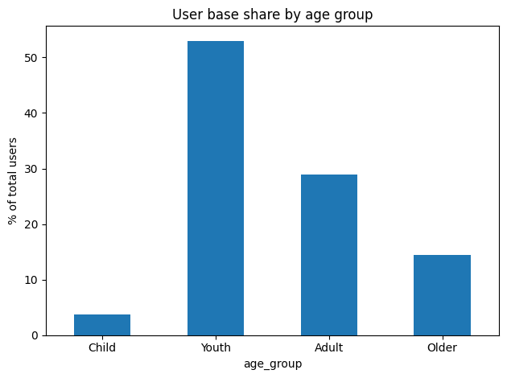
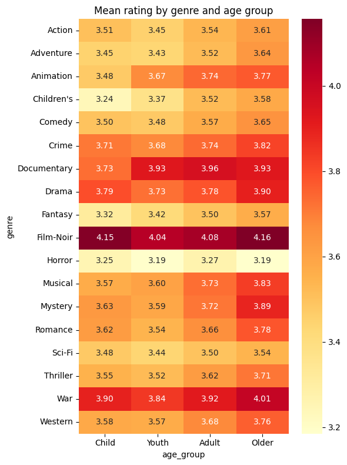
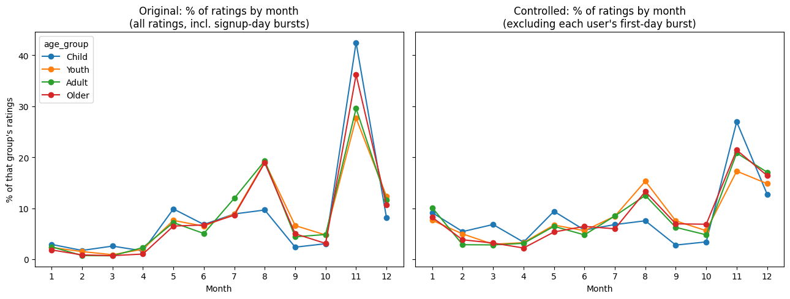
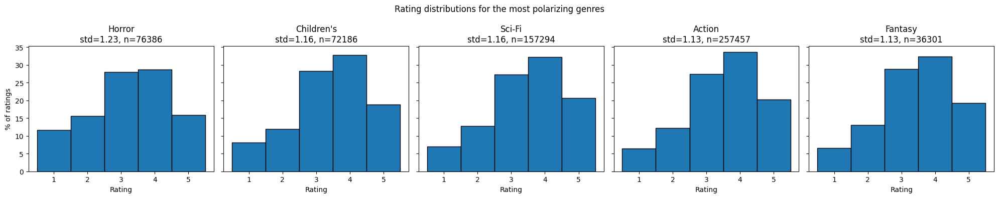

# MovieLens 1M — Age Group Viewing Behavior Analysis + Recommender

An exploratory data analysis of the MovieLens 1M dataset, looking at how
movie-rating behavior differs across age groups (genre preference, timing,
rating generosity, disagreement), followed by statistical significance
testing on the more interesting gaps, a confound check, and a simple
item-based collaborative filtering recommender built on top.

## What's in here

- **Genre and demographic patterns** — what each age group rates highly,
  how large each group is, and where gender splits show up within an age
  group.
- **Timing patterns** — what time of year and time of day each group is
  most active, with a follow-up check for whether the "seasonal" pattern
  is real or a signup-wave artifact.
- **Statistical testing** — Welch's t-tests and Cohen's *d* on the two
  most interesting gaps found in the EDA, so they're not just eyeballed.
- **A basic recommender** — item-based collaborative filtering with cosine
  similarity, evaluated against a naive baseline, plus a small reusable
  Python module (not just notebook-only code).

## Key findings

- **Genre rankings are strikingly similar across age** — Film-Noir, War,
  and Drama top every group's list, most plausibly a self-selection effect
  (genre enthusiasts rating niche genres) rather than a genuine age-driven
  taste difference.
- **The Child group's gender split on Children's/Animation genres is real**,
  not noise (Welch's t, p < 0.001 for both genres) — female raters in that
  group rate these genres noticeably higher than male raters.
- **Older raters rate more generously than Child raters**, and this holds
  up after correcting for the fact that some users just rate more often
  (p < 0.001 at both the raw-rating and per-user level).
- **The Section 7 "seasonal" pattern is real but overstated.** 32–50% of
  each age group's users made their first-ever rating in a single month
  (November 2000), and 68–78% of all ratings happened on a user's first
  day of activity — a one-time signup burst, not steady calendar-driven
  behavior. The pattern survives after controlling for this (r = 0.86–0.94
  correlation before/after), but its magnitude is inflated.
- **Horror isn't cleanly bimodal**, but it does have a distinctly heavier
  low-rating tail (11.7% one-star vs. 6–8% for other high-disagreement
  genres) rather than a true two-camp love/hate split.
- **A simple item-based CF recommender beats a naive global-mean baseline
  by ~10% RMSE** (0.99 vs. 1.11 stars) and produces qualitatively sensible
  recommendations (e.g. a user who rated classic musicals highly gets more
  classic musicals recommended).

See the notebook's final "Findings & interpretation" and "Following up on
the suggested next steps" sections for the full write-up — every claim is
paired with an interpretation *and* a stated limitation, not presented as
settled fact.

## Sample visuals

| | |
|---|---|
|  |  |
|  |  |

## Project structure

```
.
├── notebooks/
│   └── movielens_age_group_analysis.ipynb   # full analysis, EDA -> stats -> recommender
├── src/
│   └── recommender.py                       # reusable ItemBasedRecommender class
├── tests/
│   └── test_recommender.py                  # unit tests on synthetic data
├── data/
│   └── README.md                            # dataset download instructions + citation
├── images/                                  # sample chart exports used in this README
├── requirements.txt
└── LICENSE
```

## Setup

```bash
git clone <this-repo-url>
cd <repo-name>
python -m venv .venv && source .venv/bin/activate   # optional but recommended
pip install -r requirements.txt
```

Then download the MovieLens 1M dataset into `data/` — see
[`data/README.md`](data/README.md) for the direct link and instructions.

## Running the analysis

```bash
jupyter notebook notebooks/movielens_age_group_analysis.ipynb
```

Run all cells top to bottom. The notebook reads `../data/*.dat`, so it
expects to be run from the `notebooks/` folder (the default when opened via
Jupyter from the repo root).

## Using the recommender standalone

```python
import pandas as pd
from src.recommender import ItemBasedRecommender

ratings = pd.read_table("data/ratings.dat", sep="::", header=None,
                         names=["user_id", "movie_id", "rating", "timestamp"],
                         engine="python")

model = ItemBasedRecommender(min_movie_popularity=50).fit(ratings)
model.recommend(user_id=1, n=5)
```

## Running tests

```bash
pytest tests/
```

Tests run against a small synthetic ratings table (not the full dataset),
so they run instantly and don't require the data download.

## Dataset

MovieLens 1M (GroupLens Research) — 1,000,209 ratings from 6,040 users on
3,706 movies, collected in 2000. See [`data/README.md`](data/README.md)
for the citation and license note.

## Scope and honesty notes

This is a portfolio/learning project, not a production system:

- The recommender is a plain, unregularized item-based CF model (cosine
  similarity + a popularity floor) — no bias terms, no matrix
  factorization, no hyperparameter tuning. A ~10% RMSE improvement over
  a naive baseline is a real but modest signal, not a competitive
  benchmark result.
- Several EDA interpretations are explicitly flagged as hypotheses, not
  proven causal claims (see the notebook's per-section "Interpretation"
  and "Limitation" notes).
- This dataset is from 2000 and reflects an early, narrower internet-using
  population — its demographic proportions and "seasonal" patterns
  shouldn't be read as representative of a modern streaming audience.

## Author

Moses — Industrial Mathematics graduate, background in data analytics
(Power BI, SQL, Python) and secondary school mathematics teaching.
